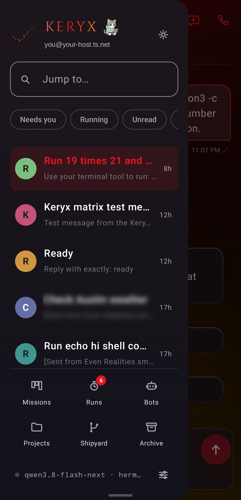
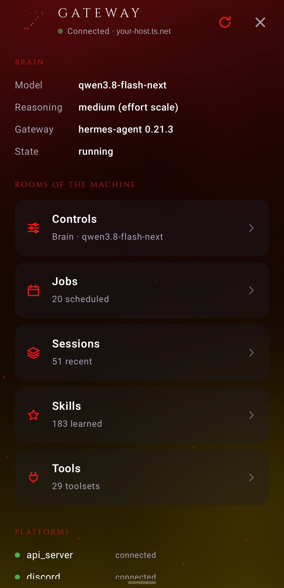
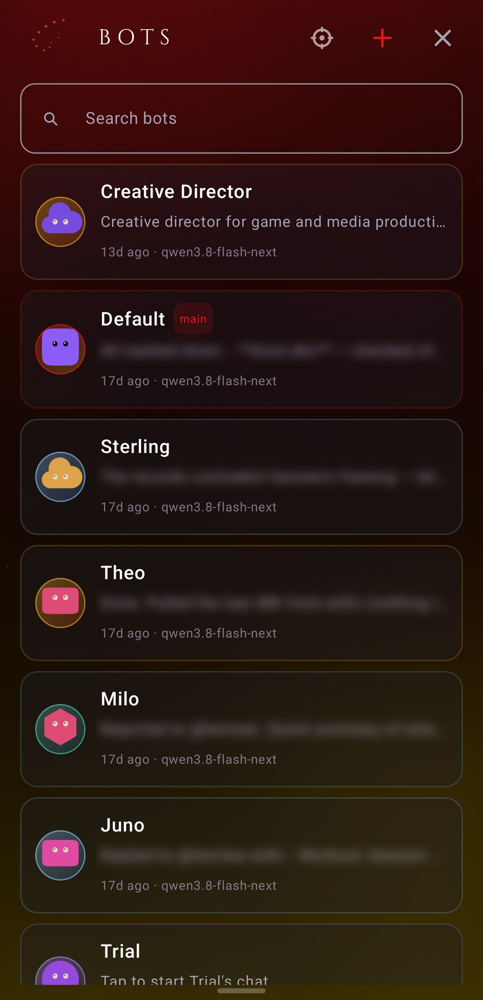

<p align="center">
  
</p>

<h1 align="center">Keryx</h1>

<p align="center">
  <b>A dream-styled Android client for <a href="https://github.com/NousResearch/hermes-agent">Hermes</a> agents.</b><br>
  Live token streaming, folded reasoning, tool cards, and the whole gateway in your pocket.
</p>

<p align="center">
  <a href="docs/README.md"></a>
  <a href="https://github.com/CocaKova/keryx/releases/latest"></a>
  <a href="https://x.com/jonnykov"></a>
</p>

<p align="center">
  <a href="https://github.com/CocaKova/keryx-stream"></a>
  
  
  
</p>

<p align="center">
  
  
  
  <br><sub>A turn with its reasoning and tool output open · the drawer · the Gateway panel</sub>
</p>

Keryx turns a shared agent room into a real interface, rendered in a deliberate visual language
instead of a wall of raw model output. It works over Matrix or straight against the gateway, and
nothing in it is tied to one deployment: any Matrix homeserver and any hermes-agent gateway will do.

**[Read the docs →](docs/README.md)** Start at [getting-started.md](docs/getting-started.md); that page
takes you from APK to a live turn.

## The pieces

| Directory | What it is |
|---|---|
| `Hermes-Chat/` | The Android app: `:app` (Compose + Trixnity Matrix SDK) and `:core` (pure KMP) |
| `Hermes-Chat/hermes-plugin/keryx-stream/` | The gateway half, in-tree. The standalone [keryx-stream](https://github.com/CocaKova/keryx-stream) plugin is the one to install |
| `tools/` | `ship.sh`, the build gate. Its contract is in [`tools/README.md`](tools/README.md) |
| `Hermes-Chat/docs/` | Internal build plans and pass notes; user docs are in [`docs/`](docs/README.md) |

## In short

- **Dual-tier live streaming.** A transient SSE side-channel renders tokens live; the room gets one
  final committed message, so no `m.replace` bloat. No side-channel, and it falls back to the committed
  turn, transparently.
- **A parser built for agent output.** Folded reasoning, grouped tool runs with verdicts, structured
  JSON as cards, footers and cron check-ins as low-contrast telemetry. GFM tables, scrollable code with
  copy, healed fences, Mermaid.
- **Two doors, one chrome.** Matrix (rooms, the council's per-agent hues) or the direct gateway door
  (sessions, projects, runs, bots, the hub panels). One `DoorLexicon` per door says the noun.
- **Answerable notices.** Reply inline from the lock screen; one-tap option buttons and phone-action
  tiles ride as structured markers, and the tap is the consent. No distributor app needed: it holds its
  own ntfy WebSocket, a UnifiedPush distributor is preferred when present.
- **Places over tabs.** Archive (a local FTS index, so it works with the gateway down), Missions,
  Projects, Shipyard, Runs, Bots, the Gateway hub, the fleet of many gateways on one phone.

## A closer look

<p align="center">
  
  
  
  
  <br><sub>Steer a running turn · the reasoning dial · the model picker · the bot roster.
  More in <a href="docs/features/controls.md">controls</a> and <a href="docs/features/spaces.md">spaces</a>.</sub>
</p>

## Quick reference

```bash
# install (the APK from the Releases page)
adb install -r keryx-<version>.apk

# build (no emulator on arm64 Linux; the on-device canary needs a phone on adb)
cd Hermes-Chat && ../tools/ship.sh --release
```

Gateway side, in four lines: clone [keryx-stream](https://github.com/CocaKova/keryx-stream), run its
`install.sh`, `hermes plugins enable keryx-stream`, `hermes gateway restart`. Then in
Settings → **Hermes Link** set the Gateway URL to the plugin's server (`http://<gateway-host>:8646`),
paste your `API_SERVER_KEY`, and hit **Test link**. The whole walkthrough is in
[gateway-setup.md](docs/gateway-setup.md).

## Status

Actively developed and released; see [Releases](https://github.com/CocaKova/keryx/releases) and the
[Changelog](docs/CHANGELOG.md). The gateway half was first proposed upstream as
[NousResearch/hermes-agent#57091](https://github.com/NousResearch/hermes-agent/pull/57091); Hermes keeps
third-party integrations out of core, so it lives as the standalone plugin, built on the stream observer
hooks Hermes ships.

## Follow along

<p>
  <a href="https://x.com/jonnykov"></a>
  <a href="https://github.com/CocaKova"></a>
</p>
