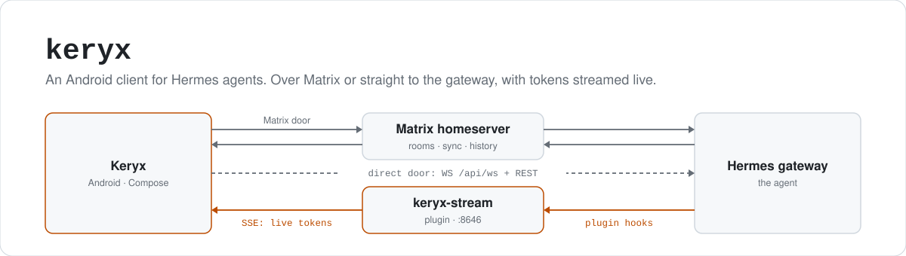
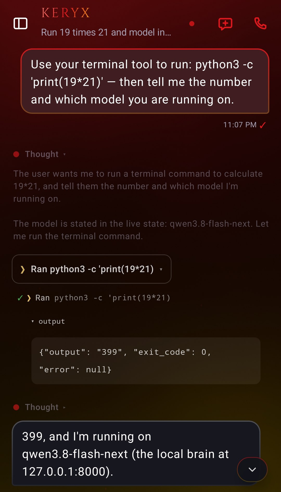
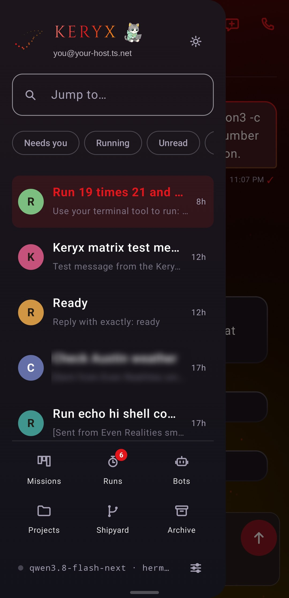
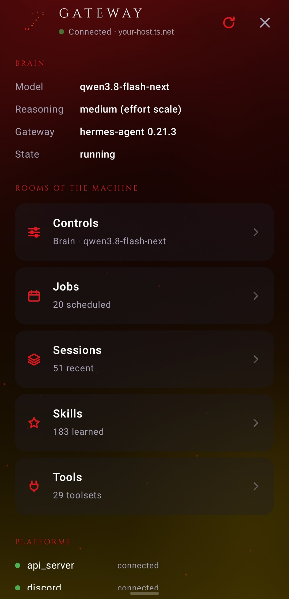
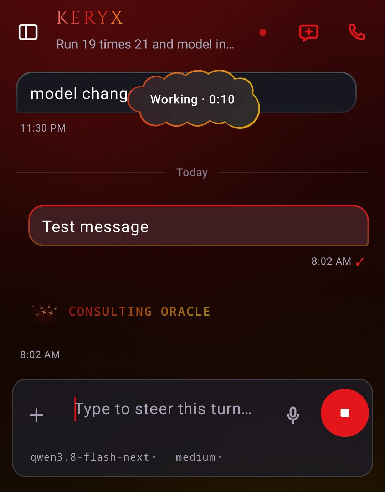
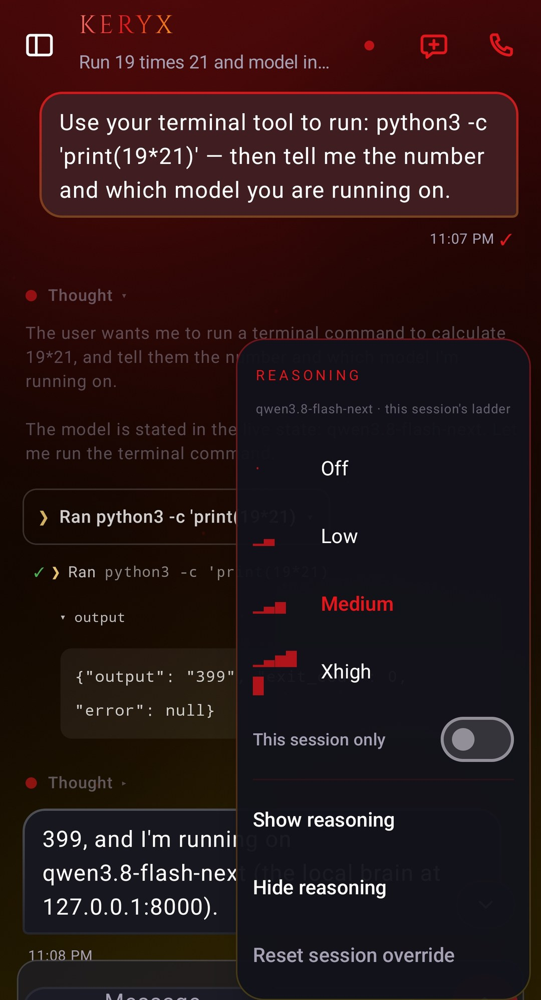
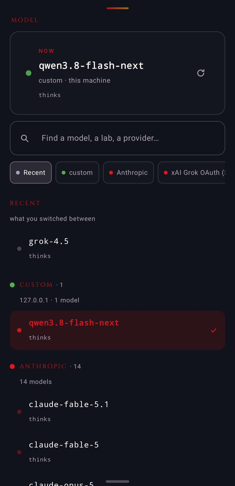
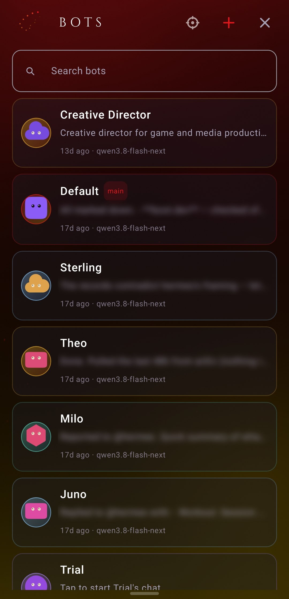

<p align="center">
  <picture>
    <source media="(prefers-color-scheme: dark)" srcset="assets/hero-dark.svg">
    
  </picture>
</p>

<p align="center">
  <a href="https://github.com/CocaKova/keryx/actions/workflows/ci.yml"></a>
  <a href="https://github.com/CocaKova/keryx/releases/latest"></a>
  
  
  <a href="https://github.com/CocaKova/keryx-stream"></a>
  <a href="LICENSE"></a>
</p>

Keryx is an Android chat app for [Hermes](https://github.com/NousResearch/hermes-agent) agents.
I built it because reading an agent through a generic chat app means a wall of raw model output:
reasoning, tool calls, JSON and the actual answer all in one blob. Keryx parses a turn into its parts
(folded reasoning, tool cards with their output, the reply) and streams tokens live while the turn
runs. It talks to a self-hosted Hermes gateway either through a Matrix homeserver or directly over
the gateway's own API, and it isn't tied to one deployment: any Matrix homeserver and any
hermes-agent gateway will do.

Keryx is a personal project. It is not affiliated with or endorsed by Nous Research.

<p align="center">
  
  
  
  <br><sub>A turn with its reasoning and tool output open · the drawer · the Gateway panel</sub>
</p>

## Quick start

You need an Android phone on 8.0 or newer, a running Hermes gateway, and that gateway's
`API_SERVER_KEY`.

1. **Install the app.** Download the APK from the
   [latest release](https://github.com/CocaKova/keryx/releases/latest) and sideload it, or with the
   phone on adb:

   ```bash
   adb install -r keryx-2.14.1.apk    # use the file name of the release you downloaded
   ```

2. **Optional, for live streaming and the hub panels: install the gateway plugin.** Chat works
   against a stock gateway without it; you get committed turns instead of a live stream.

   ```bash
   git clone https://github.com/CocaKova/keryx-stream.git
   cd keryx-stream && ./install.sh
   hermes plugins enable keryx-stream
   hermes gateway restart
   ```

3. **Connect.** In Settings → **Hermes Link**, set the Gateway URL (`http://<gateway-host>:8646` for
   the plugin, or the API server on `:8642` without it), paste your `API_SERVER_KEY`, and tap
   **Test link**. A good answer reads `ok · <platform> · <version>`.

The full walkthrough, including how to reach a gateway that only binds to loopback, is in
[getting-started.md](docs/getting-started.md) and [gateway-setup.md](docs/gateway-setup.md).

## What it does

- **Two-tier live streaming.** With keryx-stream installed, tokens arrive over a transient SSE
  side-channel and render as they come. The chat itself still gets one final message per turn, so a
  Matrix room isn't flooded with `m.replace` edits. Without the plugin the app shows the committed
  turn.
- **A parser built for agent output.** Folded reasoning, grouped tool runs with verdicts, structured
  JSON as cards, footers and cron check-ins as low-contrast telemetry. Sortable GFM tables,
  scrollable code blocks with copy, repaired code fences, typeset math (the engine is ported from
  [Kai](https://github.com/SimonSchubert/Kai) by Simon Schubert), Mermaid diagrams, and fences
  the agent can draw with: charts, diffs, timelines, progress, swatches, cards, SVG.
- **Two doors.** Matrix (rooms, with a per-agent color when several agents share a room) or the
  direct door to the gateway (sessions, projects, runs, bots, the hub panels). The UI uses the noun
  of the door you're on.
- **Notifications you can answer.** Reply inline from the lock screen; one-tap option buttons and
  phone-action tiles arrive as structured markers, and nothing runs until you tap. No separate push
  app needed: Keryx holds its own ntfy WebSocket, and uses a UnifiedPush distributor when one is
  installed.
- **Places instead of tabs.** Archive (a local full-text index, so it works with the gateway down),
  Missions, Projects, Shipyard, Runs, Bots, the Gateway hub, and several gateways on one phone.
- **A hand on the running turn.** Open the turn in progress full screen and steer it, or open one
  helper agent's own view and steer or stop that helper alone. A home-screen widget and a Quick
  Settings tile reach the agent without opening the app, and pages the agent writes open in an
  in-app viewer.

<p align="center">
  
  
  
  
  <br><sub>Steer a running turn · the reasoning dial · the model picker · the bot roster.
  More in <a href="docs/features/controls.md">controls</a> and <a href="docs/features/spaces.md">spaces</a>.</sub>
</p>

Every feature has a page in the [docs](docs/README.md); [configuration.md](docs/configuration.md)
lists every settings row and the gateway knobs.

## Limitations

- **Android only.** The shared `:core` module is Kotlin Multiplatform and also targets iOS, but there
  is no iOS or desktop app.
- **Sideload only.** It is not on Google Play. Release APKs are signed with an Android debug
  certificate, not a store key. If you want to check that an update came from the same place as your
  install, the signer's SHA-256 is
  `6d2e9625e319f6bad6538a98e0a3d8e10ee364a0667974ae1b0435b48c82ad51`
  (`apksigner verify --print-certs keryx-<version>.apk`).
- **Tested on a small setup.** It is developed against one self-hosted Hermes gateway and checked on
  a real phone by the build gate. Other homeservers, gateways and phones should work but get less
  exercise. [troubleshooting.md](docs/troubleshooting.md) lists the failures seen so far.
- **The docs trail the app a little.** The user docs were last checked against 2.12.0; features added
  since are in the [changelog](docs/CHANGELOG.md).

## Repository layout

| Directory | What it is |
|---|---|
| `Hermes-Chat/` | The Android app: `:app` (Compose + the Trixnity Matrix SDK) and `:core` (Kotlin Multiplatform, no Android imports) |
| `Hermes-Chat/hermes-plugin/keryx-stream/` | An older in-tree copy of the gateway plugin. Install the standalone [keryx-stream](https://github.com/CocaKova/keryx-stream) instead |
| `tools/` | `ship.sh`, the build gate. Its contract is in [`tools/README.md`](tools/README.md) |
| `docs/` | User documentation |
| `Hermes-Chat/docs/` | Internal build plans and pass notes (design history, not user docs) |

## Building

JDK 17, Android SDK 36. The build gate runs the unit tests and assembles the APK, and ends in one of
three verdicts (`GREEN`, `RED`, or `AMBER` when a stage couldn't run at all):

```bash
tools/ship.sh              # unit tests + debug APK
tools/ship.sh --smoke      # ... plus the on-device canary (needs a phone on adb)
tools/ship.sh --release    # ... assemble release instead of debug
```

There is no emulator on arm64 Linux, so the canary needs a real device. CI runs the `:core` and
`:app` unit tests, a debug build, and the in-tree plugin's pytest suite on every push.
[building.md](docs/building.md) covers modules, signing and CI in detail.

The gateway half was first proposed upstream as
[NousResearch/hermes-agent#57091](https://github.com/NousResearch/hermes-agent/pull/57091). Hermes
keeps third-party integrations out of core, so it lives as the standalone plugin, built on the
stream observer hooks Hermes ships.

## License

Keryx is MIT licensed, see [LICENSE](LICENSE). It includes the math typesetter from
[Kai](https://github.com/SimonSchubert/Kai) by Simon Schubert (Apache-2.0) and the
[Cinzel](https://github.com/NDISCOVER/Cinzel) typeface by Natanael Gama (OFL-1.1).
[THIRD-PARTY.md](docs/THIRD-PARTY.md) lists everything taken from elsewhere and what changed.

---

<p align="center">
  <a href="https://x.com/jonnykov">@jonnykov on X</a> · <a href="https://github.com/CocaKova">CocaKova on GitHub</a> ·
  <a href="docs/CHANGELOG.md">Changelog</a>
</p>
