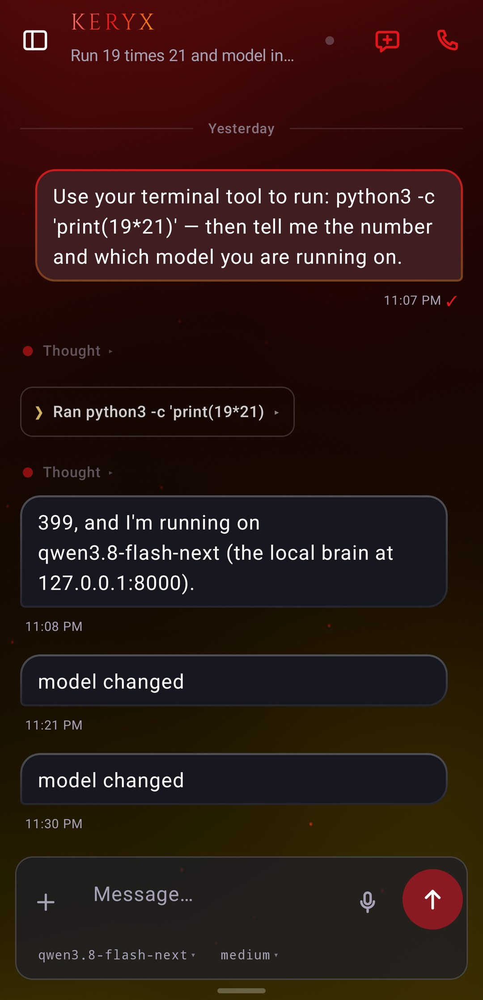
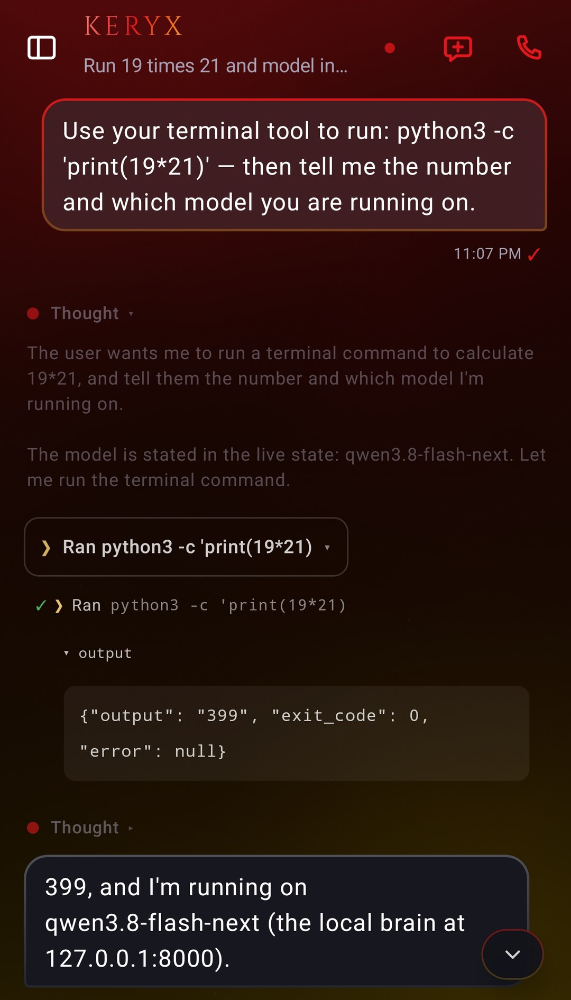

# Chat and rendering

The transcript: what each part of a turn is, and what the markdown engine does with an agent's
output. This is the floor of the app; every other place is pushed on top of it.

## What a turn is made of

One agent turn arrives as a small stack of pieces, each with its own row.

| Piece | Where it comes from | How it renders |
|---|---|---|
| Your message | the composer | right-side bubble |
| Reasoning | `reasoning` SSE frames, or the `$$` block in the committed text | a collapsed disclosure, tap to open |
| Tool calls | `tool` SSE frames, or the parsed tool rows in the committed text | one card per call, several grouped on a rail |
| The answer | `delta` frames live, the committed message after | left-side bubble |
| Footers and cron check-ins | committed text | low-contrast telemetry rows, never styled as chat |

The live and committed halves are the same information. The committed message is the source of truth;
the side-channel only draws it earlier and adds what the wire has and the text does not, which is
mostly durations and verdicts.

<p align="center">
  
  
  <br><sub>One turn, folded and unfolded: the <b>Thought</b> disclosure, the tool card, and its output.</sub>
</p>

## The reasoning disclosure

The agent's thinking folds into a single collapsible line above the answer, so a long chain of thought
does not shove the reply off-screen. It follows the gateway's dial, and the dial's shape depends on
what the active brain actually supports:

- A local brain behind an `enable_thinking` switch is a two-position thing: Off, On.
- A cloud model takes the full effort scale, `minimal`, `low`, `medium`, `high`, `xhigh`, `max`,
  `ultra`, with `none` as the separate thinking-off state. The default when neither the session nor
  the profile names one is `medium`.

The app asks the plugin (`GET /keryx/capabilities`) which ladder it is drawing, scoped to the open
session's own route when the door knows it, so the menu matches the brain rather than a guess. Without
the plugin, you get the generic scale. See [features/controls.md](controls.md) for the dial itself.

## Tool cards and the theater

While the agent works you see what it is doing rather than a spinner. One row per call: the tool's
glyph, its name in monospace, the argument as a soft subtitle, and a check or a failure verdict. Calls
fired in one turn group on a single rail, so a five-tool turn is one object to scan, not five.

What the row knows depends on whether the turn was watched live:

- From the committed message: the tool name, and its outcome after the parser folds the text.
- From the side-channel: duration in ms, the real verdict, the clipped result, and a diff body for a
  `patch` call.

Two wire facts shape the rows, both worth knowing when a card looks odd.

1. A completion frame carries no call id, so starts and ends correlate by **order**: an end closes the
   oldest open row, first-in-first-out. The tool name breaks ties. A model that batches calls (two
   `read_file`s both opening before either closes) therefore reads correctly only because of this rule.
2. A `result` is the display result *after* any `transform_tool_result` plugin ran, clipped in the
   middle, head and tail kept with an elision marker between, because an appended verdict lives at the
   tail. The `result_len` is the unclipped size.

Subagents get their own wings: goal, model, tool count, duration, token cost, and the summary each came
back with. A delegated child is not a session you can open and its relay is never stored, so these
wings are the only window onto it.

The theater is deliberately quiet, and the committed reply renders the same calls a moment later, so a
folded theater row after a turn loses nothing.

Parallelism is *observed*, not announced. A call still open when another opens marks the overlap, but
that is a statement about when calls were announced, not how the runtime ran them. So the row says
"2 in one turn".

One more wrinkle: `diff` bodies ride with 24-bit ANSI colour. The renderer strips the escapes before
classifying lines by their leading character, or every `+`/`-` count reads zero.

## Markdown

The renderer holds up on real agent output rather than on a demo corpus.

- GFM tables become real grids.
- Code blocks scroll horizontally and carry a copy button.
- Unclosed fences are healed: a message that ends inside a ` ``` ` gets a closing one appended, so a
  half-streamed block does not eat the rest of the transcript.
- A trailing half-written marker or fence from a live stream is stripped rather than rendered.
- Bold and strike work in their structured forms, so a link inside bold is still tappable. That last
  one is a 2.11.4 fix; earlier builds dropped the link.
- Mermaid blocks are parsed into a diagram rather than dumped as text.

The highlighter's grammar list is what the on-device corpus walks, so a grammar or alias added to
`CodeHighlighting.knownTags` is covered the day it lands.

## Media

Tapping an image gives you its address; a GIF's address is the GIF. Copy grabs the bytes rather than
the URL. Files land as one MSC2530-captioned turn when they arrive with a note from the share sheet.
