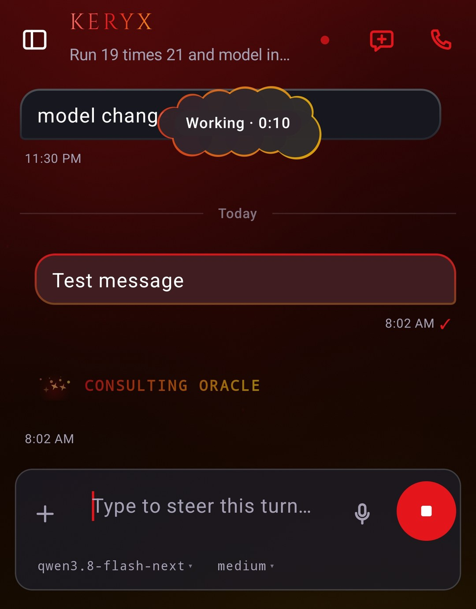
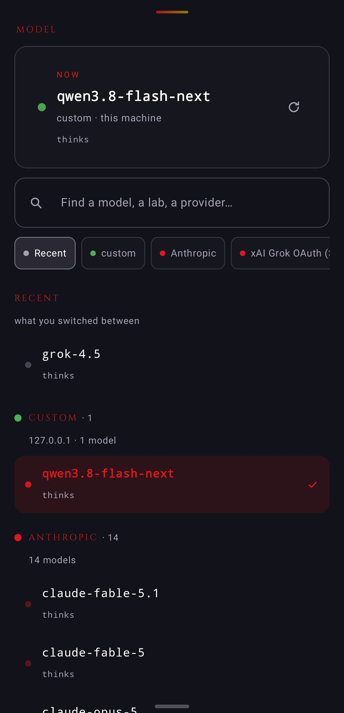
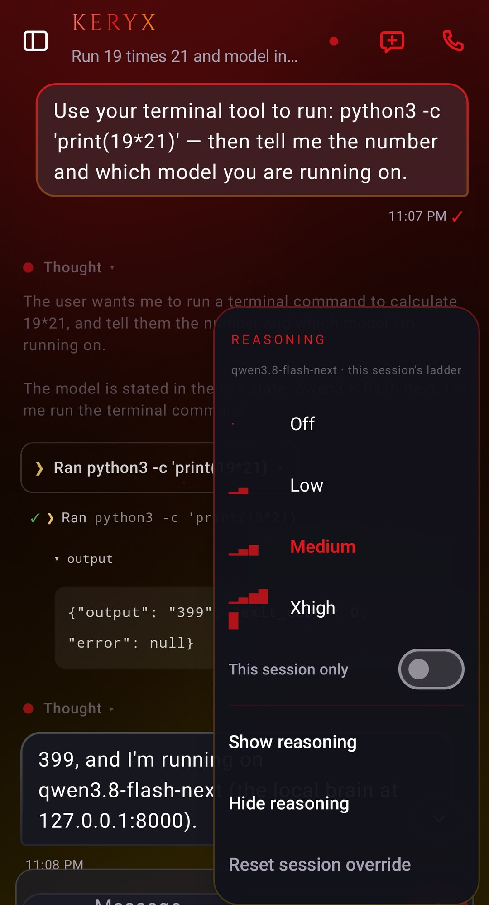
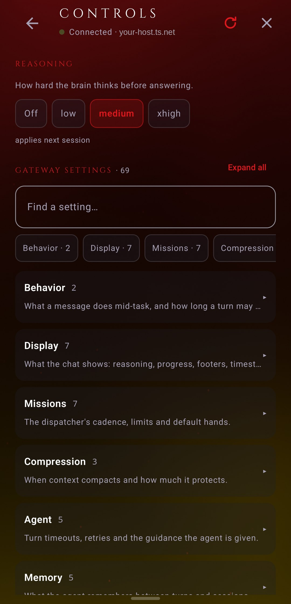

# Controls

The things you operate from the composer and the top bar: the slash palette, steer, the model
picker, the reasoning dial, the share sheet, the assistant doorway, and the hands. For what the
instruments read, see [chat-and-rendering.md](chat-and-rendering.md).

## Command palette

Typing `/` in the composer opens the palette over the composer. It filters as you type and sorts by
recency first, then by match. A command with an argument placeholder fills the composer on tap; one
without arguments sends at once.

The palette prefers the *live* registry: `GET /keryx/commands` on the plugin returns what is actually
installed on the connected gateway, core commands plus plugin-registered ones, with descriptions and
aliases. Before that answer lands, or on a gateway without the plugin, the palette falls back to its
built-in preset list:

| Command | Does |
|---|---|
| `/new` | Start a fresh conversation |
| `/compress` | Compress / summarize this thread |
| `/handoff` | Hand off context to a new session |
| `/steer` | Steer the agent mid-task |
| `/think` | Ask for deeper reasoning |
| `/model` | Switch the active model |
| `/reset` | Reset the agent's working state |
| `/help` | List what this agent can do |
| `/status` | Show agent + system status |
| `/memory` | Recall or edit long-term memory |
| `/tools` | List available tools |

A live registry entry counts as taking arguments when its `args_hint` is non-blank. Since 2.11.4 a
command that ends the run no longer leaves the room reading `steer`; the palette state is part of the
composer chrome.

## Steer

`/steer <text>` lands a course correction on a turn that is already in flight, without restarting it.
On the direct door it is the `session.steer` RPC; on the Matrix door it travels as a normal command
message. The reasoning dial and the model picker use `config.get` / `config.set` and
`model.options` / `prompt.submit` respectively, so most of what feels like typing is one JSON-RPC
request on the same socket the stream rides.

The full method list the direct door speaks is in [architecture.md](../architecture.md).

  
   Mid-turn: the composer reads <b>Type to steer this turn…</b>, send becomes stop, and the cloud carries the timer.

## Model picker

The picker reads the gateway's own catalog (`/keryx/model/options`, with the API server's
`/api/model/options` as fallback on an older plugin), so it shows what *this* gateway can answer for,
not a hardcoded list. The grouping is: this machine first, then cloud logins, then aggregators split
by lab, newest featured with the tail folded. It carries prices and free-tier gating from the catalog,
search, and a recents row.

One setting matters here, **New sessions use the last model picked** (on the direct door). Off, a new
chat opens on the gateway's configured default brain. On, it opens on whatever you last chose.

  
   The model picker: the brain in use, recents, then every provider the gateway offers.

## Reasoning dial

The dial is the `reasoning` config key, read with `config.get` and written with `config.set`, scoped
per session when a `session_id` rides along and global when one does not. The app asks
`/keryx/capabilities` which ladder the active brain actually supports and draws that one:

- A local brain behind an `enable_thinking` switch answers as `binary`: two positions, shown as
  **Off** and **On**.
- A cloud provider answers as `effort`, with the full scale: `minimal`, `low`, `medium`, `high`,
  `xhigh`, `max`, `ultra`. `none` is a separate state (thinking off), not a level on the scale.
- Neither: `none`.

The fallback value when neither the session nor the profile names one is `medium`. The capabilities
probe also reports whose dial it is, `scope: "session"` or `"global"`, so a picker opened from a room
that chose a cloud model does not show the global default's ladder.

An unknown level comes back as RPC error `4002` rather than landing silently.

  
  
   The dial from the composer, and the same ladder in Gateway → Controls above the gateway settings.

## The `/keryx/*` panels

The standalone plugin's own server carries the stream, publish, toolset and health routes; the rest of the
list below is the wider surface the panels call, and an older plugin simply has no such route. Every one
of them is 404-tolerant.

Each hub panel maps to plugin routes, all of them fail-soft: a 404 hides the panel.

| Panel | Routes |
|---|---|
| Controls | `/keryx/config` (knobs, GET + PUT), `/keryx/config/raw` (hash-checked editor), `/keryx/reasoning`, `/keryx/logs`, `/keryx/brains` + `/keryx/brain` |
| Missions | `/keryx/kanban/*` — board, task, create, comment, events cursor, subscribe |
| Skills | `/keryx/skills/{name}` GET+PUT, `/keryx/skills` POST, `/keryx/skill-trash/*` |
| Tools | `/keryx/toolsets` GET+PUT, platform-aware (matrix by default) |
| Session prune | `POST /keryx/sessions/prune`, dry-run first, ended sessions only |
| Pet | `/keryx/pet`, `/keryx/pets`, `/keryx/pet/select`, `/keryx/pet/thumb` |

The raw config editor echoes a `base_hash` on save so a change made elsewhere is a visible conflict
instead of a silent overwrite; when the gateway thinks your paste looks truncated it answers with a
`needs_force` flag and the editor asks before resending.

The Run Console (1.20) works on the *stock* surface: `POST /v1/runs`, `GET /v1/runs/{id}`,
`GET /v1/runs/{id}/events`, `/v1/runs/{id}/approval`, `/v1/runs/{id}/stop`, plus the session dialect's
`/api/sessions/{id}/chat/stream`. So the console works even against a gateway with no plugin, and its
run registry is kept on the phone because the gateway has no list-runs route.

## Share sheet

Keryx registers as a share target. Text and links, plus images, video, audio and application files,
arrive as one turn. A note you type rides as an MSC2530 caption on the first attachment, so "what's
this? + image" reaches the agent as a single message rather than two. The share flow has its own
activity, so a share never disturbs the main task stack.

## Assistant doorway

Set Keryx as the device's assist app and a long-press on home summons the agent from any screen, with
the composer ready and the nav stack collapsed to the chat floor. It is a plain `ASSIST` intent
handler; no accessibility service is involved.

## The hands

The agent proposes phone actions inside its text with `⟦keryx:do|…⟧` markers. Each becomes a tile in
the bubble and a button on the notification, and the tile performs its action **on a tap**. The tap is
the consent: nothing runs by itself, nothing runs twice.

The kinds, straight from the parser:

| Kind | Shape |
|---|---|
| `url` | `url|https://…` |
| `dial` | `dial|+15125550100` |
| `sms` | `sms|+1…|body` |
| `email` | `email|to|subject|body` |
| `calendar` | `calendar|title|start|end|where` (ISO date-times, end and where optional) |
| `alarm` | `alarm|HH:MM|label` (24 h) |
| `timer` | `timer|10m|label` (seconds, or `Nh`/`Nm`/`Ns`; `1:30` is m:ss) |
| `navigate` | `navigate|place or address` |
| `search` | `search|query` |
| `play` | `play|song or artist` |
| `open` | `open|App name` |
| `copy` | `copy|text` |
| `torch` | `torch|on` / `torch|off` |
| `share` | `share|text` |

Every kind takes exactly one primary argument; some carry one to three more. Arguments are trimmed,
an empty trailing one is dropped, and each kind validates what it accepts: an alarm at `25:99`, a
timer of `soon`, a torch set to `maybe`, a URL without a scheme, a calendar start that is not an ISO
date-time, all parse to *not an action*, and the marker then stays literal text so you can read what
was asked and see that nothing ran. A message carries at most four tiles.

The hands ride on system intents only: `VIEW`, `DIAL`, `SENDTO`, `WEB_SEARCH`, `SET_ALARM`,
`SET_TIMER`, calendar insert, media play-from-search, and launcher lookup for `open`. A timer's length
is bounded by what the clock's `EXTRA_LENGTH` can hold (`2147483647` seconds); anything longer is not
a duration and does not land.

## Ask and voice

`⟦keryx:ask|A|B|C⟧` becomes one-tap option buttons on the notification and reply chips in the bubble.
They answer the agent's blocking question without opening the app; see the shade in
[notifications-and-hands.md](notifications-and-hands.md).

`⟦keryx:voice⟧` marks a reply as spoken-call text, and the built-in TTS engine reads it. Voice input
is the microphone on the composer (dictation via the gateway's STT); the two are separate switches in
Settings → Voice.
