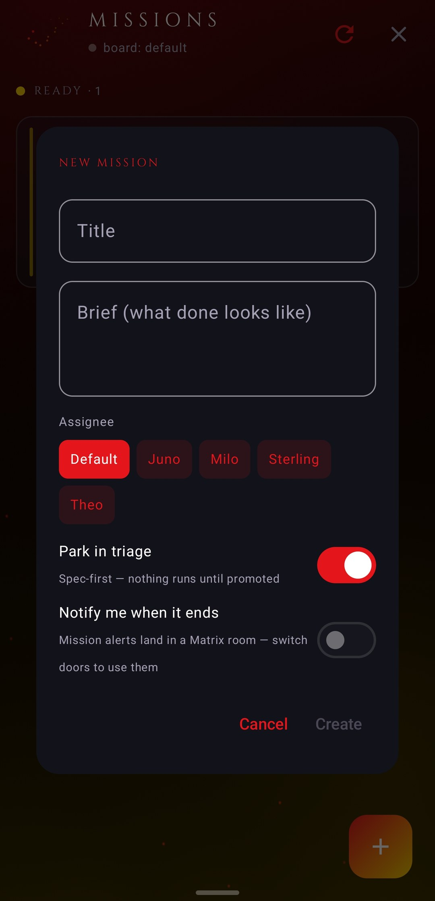
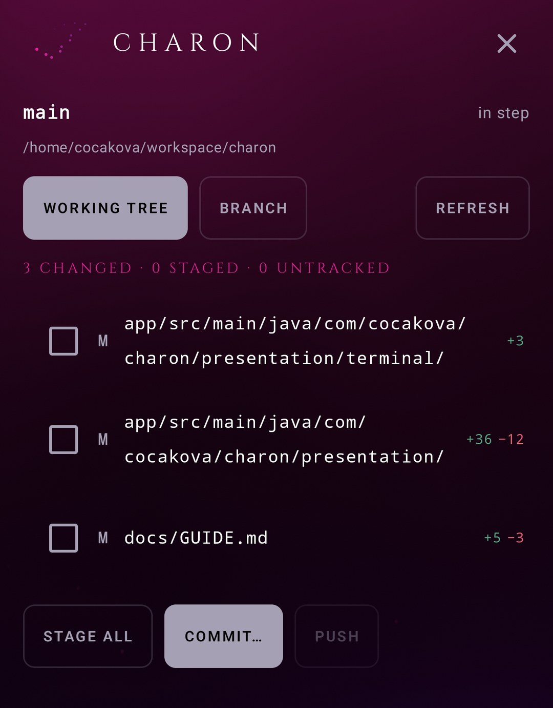

# Spaces

The places layered over the chat floor. Each is one route on the app's own back stack, and the chat
stays composed underneath, so a back gesture returns exactly where you were. Nouns per door are in
[concepts.md](../concepts.md).

## What is where

| Place | Route | Door | For |
|---|---|---|---|
| Archive | `archive` | both | full-text search, saved items, media gallery |
| Missions | `missions` | both | the kanban board |
| Projects | `projects` | direct only | sessions grouped by gateway workspace |
| Shipyard | `shipyard` | direct only | git review and shipping |
| Runs | `runs` | both | scheduled work, read |
| Bots | `bots` | direct only | the roster of profiles |
| Gateway | `gateway` | both | the machine: status plus spokes |
| Settings | `settings` | both | the app's own configuration |
| Artifact | `artifact?path=…` | both | a page the agent wrote, rendered |

Two legacy route names still resolve, both to Gateway: `hub` and `workshop`. A saved back stack from
2.4 or a pinned intent still lands correctly.

## Archive

A local index the app builds itself, so search answers in milliseconds and works with the gateway
down. An encrypted room cannot be searched server-side, since the phone is the only place its plaintext
exists, and that is why this index is on-device rather than a proxy.

Three views over it. Full-text search across the room's whole history, on `fts4` with a unicode61
tokenizer. A date jump. And the media gallery: every photo and file the room carried. Tapping any hit
opens a live context window around that moment in the transcript, not an isolated string. Long-press a
message anywhere and the Save action adds it to a Saved list that reads here too. Re-indexing a room
replaces its rows; clearing drops the whole index and rebuilds it from the synced state.

On the direct door the Archive reads across sessions rather than only the open one, so a search finds
the turn rather than the turn's container.

## Missions

The gateway's kanban board, from the same database the agent's own `kanban_*` tools use, so the
dispatcher's writes and the phone's reads see one truth. Reads and additive writes only: the state
transitions (complete, block, claim) stay agent-side, because the dispatcher owns those.

The board lists tasks grouped by raw status with counts. A task opens to its body, comments and the
last 50 events. From the phone you can create a task (`title`, `assignee` required; `body`,
`priority`, `triage`, `goal_mode` optional), comment on one, and pin its model, provider, or reasoning
effort, which apply on the next dispatch. Every route accepts `?board=<slug>` for a non-default board.

An `assignee` is required on create on purpose: the dispatcher only spawns assigned tasks. `triage:
true` parks a card spec-first instead of letting the dispatcher pick it up. Phone-originated writes are
authored as `keryx` server-side; a caller-supplied author is rejected, since a forged author reads as a
system directive in a later worker's context.

Subscriptions give real-time alerts without polling: subscribe the current chat to a task and the
gateway's notifier posts a native message into that room when the task hits a terminal state
(completed, blocked, gave_up, crashed, timed_out). It needs the gateway's notifier loop
(`kanban.dispatch_in_gateway`) enabled. A subscription that vanishes between refreshes means it fired,
since the notifier deletes rows once a task is genuinely done. A 15-minute worker poll remains the
fallback for comments and non-terminal events.

A gateway with no kanban board answers these routes with errors the app reads as "missions
unavailable"; the panel hides and nothing else is affected.

  
   A new mission: title, brief, assignee, and whether it parks in triage first.

## Projects

The gateway's native workspace grouping. A project is a workspace (folders on the host); a session
belongs to whichever project claims its cwd. The list carries explicit projects plus auto-discovered
repos, and drills into one as a flat, recency-ordered session list, with lanes as quiet captions rather
than a tree. Sessions open on the chat floor like any other. The Home bucket stays out of the list,
because the drawer already is it. Only a project you made keeps its sessions out of the drawer's flat
list.

## Runs

Everything the agent does on a schedule, as a place of its own. The layout, top to bottom: the runs you
kept, as a shelf (pinned on the gateway, so the report worth coming back to has an address); an arrivals
rail of what landed since you last looked, each report wearing its own headline so it can be read here
rather than merely counted; then one card per job. On the direct door a run opens as a real room with
the full renderer; on the Matrix door it opens in the transcript reader.

A long press on any run row offers keep / release and read-when-new. The pin is the gateway's own keep
flag, the same one the desktop writes, so a report pinned on the phone is pinned everywhere and exempt
from the auto-archive sweep. You do not converse with a cron job here; the Jobs spoke under Gateway
manages the schedules, this reads their work.

## Bots

Bot Mode, direct door only. The roster of the gateway's profiles, each one tap from its own forever-
chat, arranged on shelves, with the newest active rows first. The roster is the active gateway's, not a
union across the fleet.

  
   The roster: one card per Hermes profile, with its last line and brain.

## Gateway

One door for the machine, with the landing on what it is doing: status, the brain, the last turn. The
rest are spokes, one row each with a line of what is behind it, opened one at a time:

- **Controls**, the whitelisted config knobs and the raw editor, the reasoning dial, the logs tail,
  the brain swap.
- **Jobs**, the scheduled list with pause / resume / run / delete and a create-and-edit sheet.
- **Sessions**, the session list with rename, pin, fork, prune and its context breakdown.
- **Skills**, the Skill Forge: read and write `SKILL.md` through the gateway's own validation and
  security scan, with a one-deep undo kept beside each file.
- **Tools**, the platform-aware toolset toggles.

Each panel caches its last gateway answer so it reads offline, and one with a 404 route is hidden
rather than stubbed. The hub's snapshot store keeps only plain GETs; parameterized paths and per-run
polls are not cached, so the cache cannot grow without bound.

  
   Gateway: the brain and its state on top, then one row per room of the machine.

## Shipyard

Git review and shipping over the direct door, gated on the gateway's `git` capability, so on a gateway
without it the spoke does not appear at all. Three levels inside one place: the repo roster, one repo's
changed files, one file's diff. Stage or unstage per file or all, a commit sheet pre-armed with recent
subjects, push, and the PR line says the true thing.

Two things are absent on purpose: revert, which destroys work no git object holds, and create-PR, which
would open a pull request as the gateway's user.

  
   The Shipyard on one repo: changed files with their line counts, then stage, commit, push.

## Artifact

A page the agent wrote — a mockup, a report, a dashboard it built for you — rendered in the app
instead of handed to a browser. An `.html` file the agent sends as media becomes a page card
(`Open · name`), and on the direct door a bare absolute `/…/*.html` path in a reply gets an
`Open <name>` chip under the bubble. Either opens this space.

How it reads the file: bytes that came through the room first (both doors, the media cache); else,
on the direct door, the dashboard's `GET /api/fs/read-text?path=` behind the same token as every
other call, with the whole file fetched when the preview cap (512 KiB) truncates it. The path is
whatever the agent named, so this reads anything the gateway user can read — the same trust the
tool calls already carry.

The page runs in a fenced WebView: JavaScript and DOM storage on (a mock with a chart still
works), file and content access off, no JavaScript bridge into the app, mixed content blocked,
loaded with no base URL so a relative fetch goes nowhere. A link in the page opens the browser;
the viewer stays on the page. Actions: save to Downloads, share, open with another app, reload.
Back returns to the chat.

## Settings

Flat sections with search. Rows that exist on only one door are not offered on the other, so search
never opens an empty page. The full list, per door, is in [configuration.md](../configuration.md).

## Instrument set

The chat floor's non-chat readouts (context ring, flight plan, link-health dot) are described in
[chat-and-rendering.md](chat-and-rendering.md). Under Battery Saver every ornament stills and the
instruments hold at the bright end rather than reading as stopped.
